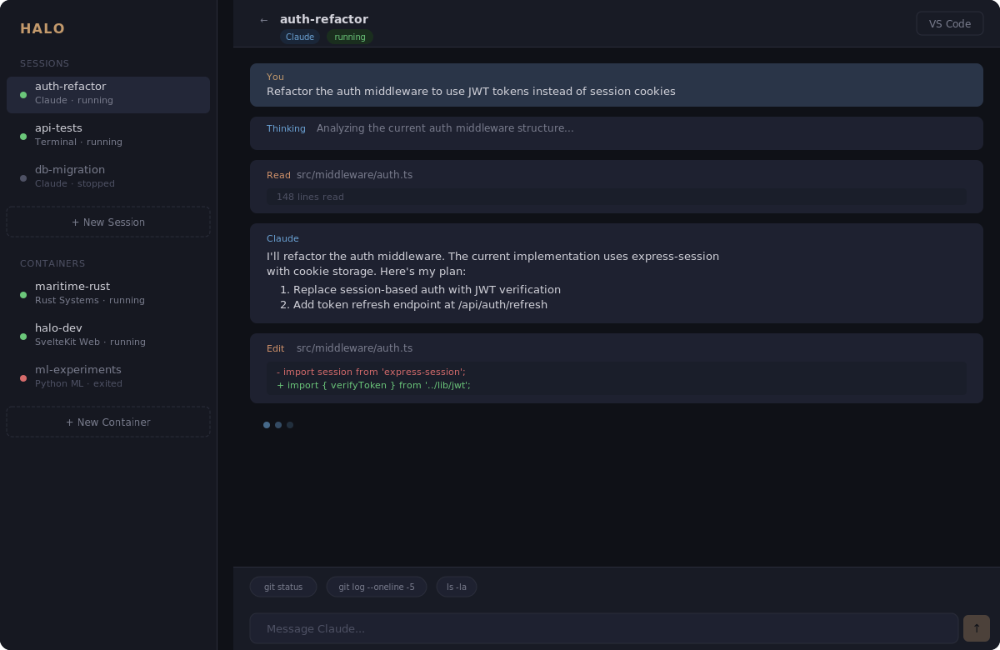
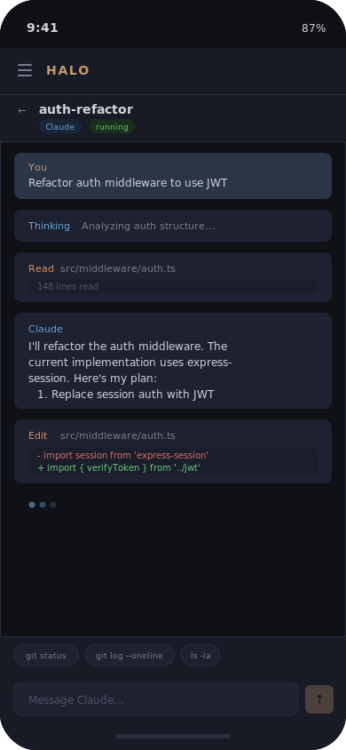
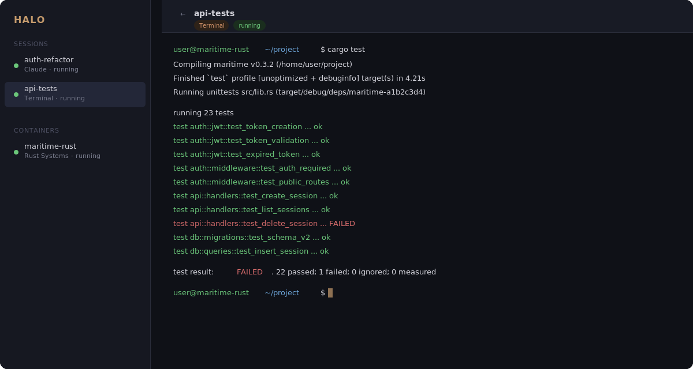

# HALO

**Hosted Agentic Loop Orchestration** — Mobile-first mission control for AI-assisted development.

HALO is a self-hosted web app that lets you manage Docker development environments, steer Claude Code sessions, and access full terminals — all from your phone. It deploys as a single container, connects through Tailscale, and gives you a secure dashboard accessible from anywhere on your tailnet.

<p align="center">
  
</p>

## Why

AI coding tools like Claude Code are powerful but assume you're sitting at a workstation. HALO removes that constraint. It gives you a single URL — `https://halo.<tailnet>.ts.net` — where you can:

- **Monitor agentic sessions** from your phone while away from your desk
- **Spin up dev containers** from templates (Rust, SvelteKit, Python ML, or blank)
- **Steer Claude** with approvals, redirects, and constraints via a chat interface
- **Drop into a terminal** or VS Code for hands-on work when needed
- **Get push notifications** when sessions need attention

<p align="center">
  
  &nbsp;&nbsp;&nbsp;&nbsp;
  
</p>

## Architecture

HALO runs as a single Docker container using Docker-outside-of-Docker (DooD) to manage sibling project containers on the host:

```
┌─────────────────────────────────────────┐
│           HALO Container                │
│  ┌────────────┐  ┌───────────────────┐  │
│  │ Tailscale   │  │ SvelteKit App     │  │
│  │  daemon     │──│  :3000            │  │
│  │  serve :443 │  │  - Dashboard      │  │
│  └────────────┘  │  - Reverse Proxy   │  │
│                  │  - WebSocket Proxy  │  │
│  ┌────────────┐  │  - REST API        │  │
│  │ Docker CLI  │  └─────────┬─────────┘  │
│  │ (socket)    │            │            │
│  └──────┬─────┘            │            │
│         │     ┌──── halo-net ────┐      │
└─────────┼─────┼──────────────────┼──────┘
          │     │                  │
   ┌──────┴─────┴──┐   ┌─────────┴────────┐
   │ project-a      │   │ project-b         │
   │  code-server   │   │  code-server      │
   │  claude-code   │   │  dev server       │
   └────────────────┘   └──────────────────┘
```

All traffic flows through Tailscale — project containers never publish ports to the host. Authentication is handled by Tailscale identity headers, so there's no login system to maintain.

## Tech Stack

| Layer | Technology |
|---|---|
| Framework | SvelteKit 2, TypeScript (strict) |
| Database | SQLite via better-sqlite3 |
| Containers | Dockerode (Docker socket) |
| Terminal | xterm.js + node-pty over WebSocket |
| Networking | Tailscale (HTTPS + auth) |
| Notifications | Web Push API |
| Styling | Vanilla CSS with design tokens |

## Getting Started

### Prerequisites

- A machine running Docker
- A [Tailscale](https://tailscale.com) account (free tier works)
- Tailscale installed on your phone/laptop

### Deploy

```bash
# Build
docker build -t halo .

# Run (first time — check logs for Tailscale login URL)
docker run -d --name halo \
  -v /var/run/docker.sock:/var/run/docker.sock \
  -v halo-data:/data \
  --cap-add NET_ADMIN \
  --device /dev/net/tun \
  halo

docker logs -f halo
```

Open the Tailscale login URL from the logs. Once authenticated, HALO is live at `https://halo.<tailnet>.ts.net`.

For subsequent runs, pass a [Tailscale auth key](https://login.tailscale.com/admin/settings/keys) to skip interactive login:

```bash
docker run -d --name halo \
  -v /var/run/docker.sock:/var/run/docker.sock \
  -v halo-data:/data \
  -e TS_AUTHKEY=tskey-auth-xxxxx \
  --cap-add NET_ADMIN \
  --device /dev/net/tun \
  halo
```

Or use docker-compose:

```bash
# Set TS_AUTHKEY in .env, then:
docker-compose up -d
```

### Data Persistence

The `/data` volume stores everything that survives restarts:

| Path | Contents |
|---|---|
| `halo.db` | SQLite database (sessions, containers, config) |
| `tailscale/state` | Tailscale authentication state |
| `templates/` | Custom devcontainer templates |
| `claude-md/` | CLAUDE.md files injected into containers |

### URL Routing

All access goes through a single Tailscale hostname:

```
/                              → Dashboard
/ide/<container>/              → VS Code (code-server)
/port/<container>/<port>/      → Forwarded app port
/ws/<container>/               → WebSocket terminal
```

## Development

```bash
npm install
npm run dev          # Dev server on :5173
npm run test         # Vitest
npm run test:e2e     # Playwright
npm run check        # TypeScript + Svelte checking
npm run lint         # ESLint + Prettier
npm run build        # Production build
```

The project follows strict Red/Green TDD — every feature starts with a failing test. See [CLAUDE.md](CLAUDE.md) for the full development methodology and code standards.

## License

This is a personal tool. No license is granted for redistribution.
